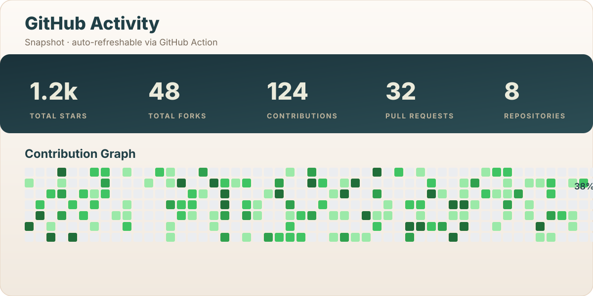

<!--
**fthyll/.github** — special repo so this README shows on @fthyll's GitHub profile.

Style inspired by Akash-chowrasia's profile README; content personalised for
Muhammad Fatih and all assets self-hosted under `asset/`.
-->

  

<h1 align="center">Hi , I'm Muhammad Fatih</h1>
<h3 align="center">AI Engineer · TarotBot Creator · Discord Bot Builder</h3>

  
  
  
  
  
  
  
  

  <em>
    This is ME, Muhammad Fatih, a <b>final-year</b> <b>informatics engineering</b> student
    who <b>loves</b> building at the intersection of <b>ancient wisdom</b> and
    <b>cutting-edge AI</b>.  
    A budding <b>AI Engineer</b>  and a
    <b>Community Builder</b> ,
     who is <b>obsessed</b> with the idea of <b>improving</b> himself and wants a
    <b>platform</b> to <b>grow</b> 
    and <b>excel</b> &nbsp;.
  </em>
   
   <b><i>Learning while HOPING &amp; HUSTLING!!!</i></b> 

  

&nbsp;<em><strong>Talking about Personal Stuffs…</strong></em>

✔ Pronouns: <em><strong>He/His</strong></em> or <em><strong>Fatih</strong></em> 😉 
✔ I'm currently building <strong>TarotBot</strong> — AI Tarot Reader for Discord <strong>@fthyll</strong> 
✔ I'm currently learning <strong>LLM Orchestration</strong> &amp; <strong>RAG Pipelines</strong> 
✔ I'm looking to collaborate on <strong>Open-Source LLM tools</strong> &amp; <strong>Discord bots</strong> 
✔ I'm looking for help with <strong>Production-grade AI infrastructure</strong> 
✔ I regularly write articles on <a href="https://dev.to/fthyll">Dev.to</a> 
✔ I work on tarot decks &amp; spreads at <a href="https://fthyll.github.io/tarot-bot-web/index.html">fthyll.github.io/tarot-bot-web</a> 
✔ Ask me about anything, I am happy to help, only if the ball is in my court! 😉 
✔ Fun fact: <em>At the time of stress coding, I use to read tarot cards for debugging hints 🃏</em>

&nbsp;<em><strong>Languages &amp; Tools I Know…</strong></em>

<code></code>
<code></code>
<code></code>
<code></code>
<code></code>
<code></code>
<code></code>
<code></code>
<code></code>
<code></code>
<code></code>
<code></code>
<code></code>
<code></code>
<code></code>
<code></code>
<code></code>
<code></code>
<code></code>
<code></code>
<code></code>
<code></code>
<code></code>
<code></code>
<code></code>
<code></code>
<code></code>
<code></code>
<code></code>
<code></code>
<code></code>
<code></code>
<code></code>
<code></code>
<code></code>

  &nbsp;<i><b>GitHub Stats</b></i>
  

  

Here are some <a href="https://cultofthepartyparrot.com">🦜 parrots</a> for fun:

  
  
  
  
  
  
  
  
  
  
  
  
  

<h4 id="want-to-build-your-own">Want to Build Your Own?</h4>

Do you like my profile and want to build your own? It's very simple. GitHub recently added a new feature called <strong>Profile READMEs</strong>. For it to work, do the following:

<ol>
  <li>Create a <em>special</em> GitHub repository with your username as repository name. My username is <code>fthyll</code>, so my profile README repository has the name <code>fthyll</code>.</li>
  <li>Add a <code>README.md</code> to this repository.</li>
  <li>Put some cool content about yourself (or anything you want) into <code>README.md</code>.</li>
</ol>

And that's about it. The <code>README.md</code> of your profile README repository will be displayed on your profile page.

Credits: inspired by <a href="https://github.com/Akash-chowrasia">Akash Chowrasia</a>'s profile README. Personalised for Muhammad Fatih.

Last edited: 2026-08-12

