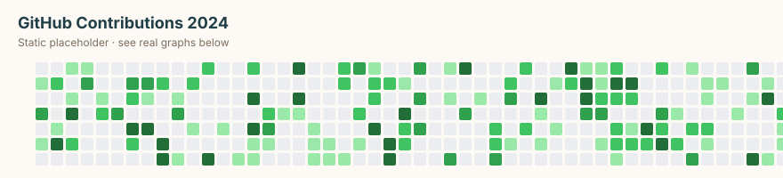
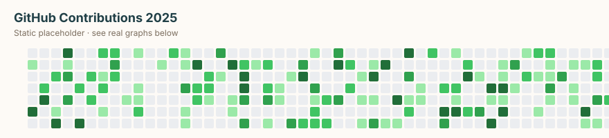

<!--
**fthyll/.github** is a ✨ _special_ ✨ repository because its `README.md`
appears on the GitHub profile of @fthyll.

All visual assets are self-hosted under `asset/` so the profile renders
fast, offline-friendly, and never breaks due to third-party downtime.

Layout:
  asset/typing/  → animated SVG intros
  asset/img/     → photos, GIFs, contribution grids
  asset/badges/  → shields.io tech stack, custom CTAs, trophy snapshot
  asset/social/  → social platform icons
-->

<!-- Animated typing intro (SMIL, ~30s loop, self-hosted) -->

<!-- Profile views (self-hosted shield) -->

  

<!-- Avatar -->

  

### 🌟 About Me

I'm a passionate developer on a mission to bridge ancient wisdom with cutting-edge AI.
I created **TarotBot** — an AI-powered tarot reading bot for Discord that combines
the mystique of tarot with the intelligence of modern LLMs.

🎯 **Current Focus:** Building LLM-based Tarot applications
🌱 **Learning:** Advanced Prompt Engineering, RAG, Fine-tuning LLMs
🔮 **Mission:** Making divination accessible with AI
💡 **Interests:** AI/ML, NLP, Esoteric Knowledge, UX Design

---

### 🎴 TarotBot — AI Tarot Reader for Discord

 

&nbsp;

&nbsp;

---

### 🔮 Project Philosophy

| ✨ Thoughtful Ritual | 📖 Private by Choice |
|:---:|:---:|
| Designed for meaningful moments, not quick answers | Your readings and journal stay private to you |

| 🧘 Daily Practice | 🤖 AI-Assisted |
|:---:|:---:|
| Daily card, weekly check-in, and private journal | Interpretation with a point of view — choose your voice |

---

### 🎨 Featured Visual

---

### ⚙️ Tech Stack

<!-- AI / ML -->

<!-- LLMs -->

<!-- Frontend -->

<!-- Backend -->

<!-- Tools -->

---

### 🏆 GitHub Trophies

Generated from <a href="https://trophygithubreadmelang.cybee.dpdns.org/?username=fthyll">trophygithubreadmelang.cybee.dpdns.org</a>

---

### 📊 GitHub Activity

 

 

Stats & contribution grids are static snapshots. Replace via
<code>curl</code> + GitHub Action for live updates.

---

### 🔗 Connect with Me

---

